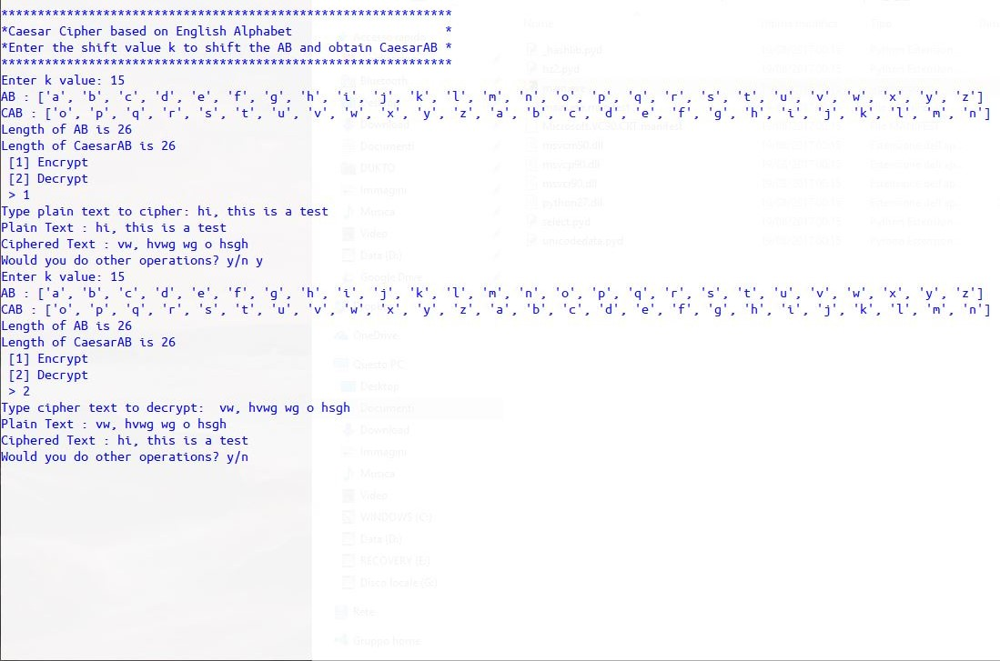

# Caesar-Text-Cipher
Simple cipher based on Caesar Cipher.

## Features

 - You can decide k shift value (mod(26))
 - Special characters are skipped
 - Convert entire text and copy, you can convert paragraphs with differents k values

The script can be modified by you, it is simple and it works. Enjoy it ;)  

##### Authors

[Me](mailto:mattiaquadrini@gmail.com)
